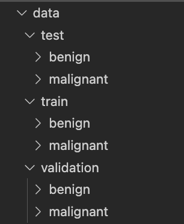
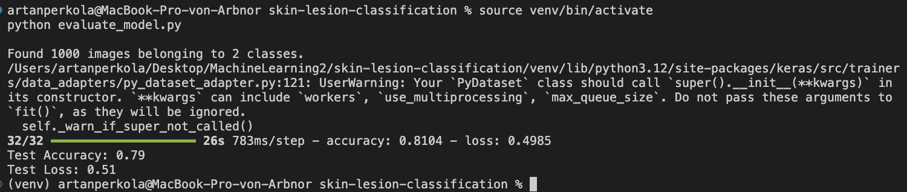
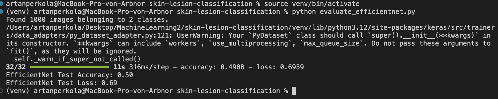
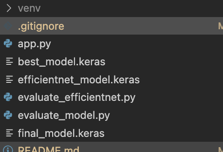

# Projekt Name: Muttermal Klassifikation

Installationsanleitung folgt weiter unten.

## Wichtige Links

- [Git Repo](https://github.com/ArtanPerkola/ML2_Project_V1)
- [Dataset](https://drive.google.com/file/d/1ecetea4tBoi4_xU4NBVCJ7Z3rpnJhEyo/view?usp=sharing)
- [Vortrainierte Modelle](https://drive.google.com/file/d/12gbtA1ATDbnhBzyyHDDx2PL4LFBZm5VL/view?usp=sharing)

## Motivation

Hautkrebs ist eine der häufigsten Krebsarten weltweit. Frühzeitige Erkennung und Behandlung sind entscheidend für die Überlebensrate der Patienten. Dieses Projekt zielt darauf ab, ein maschinelles Lernmodell zu entwickeln, das automatisch zwischen gutartigen und bösartigen Muttermalen unterscheiden kann.

## Daten

Die Daten, welche für das Training und Validierung der Modelle genutzt wurden, stammen aus Kaggle vom User MUHAMMAD HASNAIN JAVID. Es handelt sich hier bei um etwa 10000 Bilder von gut- und bösartigen Muttermalen. Das Set von Kaggle war unterteilt in "Test" und "Train" Daten. Die Bilder für die "Validation" habe ich mit hilfe des Skripts "split_data.py" erzeugt. Dieses hat 20% der Daten aus "Train" genommen und in diesem Ordner verschoben.

[Link zum Dataset auf Kaggle](https://www.kaggle.com/datasets/hasnainjaved/melanoma-skin-cancer-dataset-of-10000-images)

- *Test*: 1002 Bilder
- *Train*: 7686 Bilder
- *Validation*: 1923 Bilder

Diese Daten sind jeweils unterteilt in "benign" (gutartig) und "malignat" (bösartig).

## Modell

Für die eigentliche Applikation habe ich ein ResNet50 Modell genommen und dieses meinen Daten entsprechend angepasst. Für die Evaluation habe ich ein nur wenig angepasstes EfficientNet Modell genutzt.

Wichtig: In diesem Projekt wurde für das ResNet50 Modell der einfachheitshalber der Name "Model" genutzt.

## Interpretation und Validierung

### ResNet50 Modellergebnis

- Test Accuracy: 0.79
- Test Loss: 0.51

Bemerkung: Das Skript hat vorgesehen, dass 50 Epochen durchgeführt werden. Durch den Einsatz eines Early Stopp, welcher das Training abbricht, sobald keine Verbesserungen mehr erwartet werden, sind aber effektiv nur *14 Epochen* durchgeführt worden.

### EfficientNet Modellergebnis

- Test Accuracy: 0.50
- Test Loss: 0.69

Bemerkung: Hier wurden *10 Epochen* durchgeführt. Da sich die Werte von Epoche zu Epoche kaum veändert haben, habe ich hier keine siginifikante Verbesserung durch eine höhere Anzahl an Epochen erwartet. Ausserdem sind diese 10 Epochen vergleichbar mit den 14 für das ResNet50 Modell.

Output des Trainings:
- ResNet50-Modell: best_model.keras und final_model.keras
- Efficientnet-Modell: efficientnet_model.keras

### Schlussfolgerung

Die Ergebnisse zeigen, dass das ResNet50-Modell bessere Leistungskennzahlen erreicht hat als das EfficientNet-Modell. Die höhere Genauigkeit und der geringere Verlust von ResNet50 deuten darauf hin, dass dieses Modell besser in der Lage ist, die Unterschiede zwischen gutartigen und bösartigen Hautläsionen zu erkennen.
Es ist aber zu erwähnen, dass das Modell Verbesserungspotential hat. Eine Accuracy von 0.79 ist für den medizinischen Bereich nicht aussreichend. Ich gehe stark davon aus, dass das Modell mit mehr Daten besser trainiert hätte werden können.

## Anleitung

Um das Projekt zur Muttermal Klassifikation auf deinem lokalen Rechner einzurichten und auszuführen, befolge bitte die folgenden Schritte:

### Installation

1. Repository klonen

Öffne das Terminal und navigiere zum Verzeichnis, in welchem du das Projekt klonen möchten. Danach führe den folgenden Befehl aus:
    
    git clone https://github.com/ArtanPerkola/ML2_Project_V1.git

Nach dem klonen navigiere bitte zum erzeugten Projekt.

Alternativ kannst du auch direkt über Visio Studio Code klonen. Gib dazu oben in der Befehlsleist folgenden Befehl aus und füge danach die Github-URL zum Projekt ein.

    >git: clone

2. Virtuelle Umgebung erstellen

Erstelle eine virtuelle Umgebung, um Abhängigkeiten isoliert zu verwalten. Nutze dazu folgenden Befehl im Terminal. Wichtig, arbeite immer im Projektverzeichnis!

    python -m venv venv

3. Virtuelle Umgebung aktivieren

Führe folgenden Befehl aus, um die erstellte Umgebung zu aktivieren.

    Windows: .\venv\Scripts\activate
    MacOS oder Linux: source venv/bin/activate

4. Abhängigkeiten installieren

Installiere alle notwendigen Python-Pakete. Diese findest du in der requirements.txt.

    pip install -r requirements.txt

5. Datensatz herunterladen/einfügen

Füge dem Projekt die Daten hinzu. Achte darauf, dass die Struktur dem Bild "Datenstruktur" im Kapitel "Daten" entspricht.

Da der Upload auf Github mit allen Daten aufgrund der grösse nicht möglich ist, kannst du die Daten unter folgendem Link herunterladen: https://drive.google.com/file/d/1ecetea4tBoi4_xU4NBVCJ7Z3rpnJhEyo/view?usp=sharing 

### Modelltraining (Optional)

Um die Modelle nicht trainieren zu müssen, stelle ich euch die vortrainierten zur Verfügung. Ihr könnt diese unter folgendem Link herunterladen. Fügt die drei Dateien bitte der obersten Ebene des Projektverzeichnis hinzu (Hilfe: gleiche Ebene wie app.py zum Beispiel).

Link: https://drive.google.com/file/d/12gbtA1ATDbnhBzyyHDDx2PL4LFBZm5VL/view?usp=sharing 

1. Trainieren des ResNet50-Modells

Führe folgenden Befehl im Terminal aus (Wichitg: Du musst dich im Projektverzeichnis befinden):

    python train_model.py

2. Trainieren des EfficientNet-Modells

Führe folgenden Befehl im Terminal aus:

    Python train_efficientnet.py

### Modellevaluierung (Optional)

1. Evaluierung des ResNet50-Modells

Um das Modell zu evaluieren, führe folgenden Skript aus:

    python evaluate_model.py

2. Evaluierung des EfficientNet-Modells

Um das Modell zu evaluieren, führe folgenden Skript aus:

    python evaluate_efficientnet.py

### Anwendung starten

Führe das Skript app.py aus und öffne den Link *http://127.0.0.1:5000/*.

    python app.py
